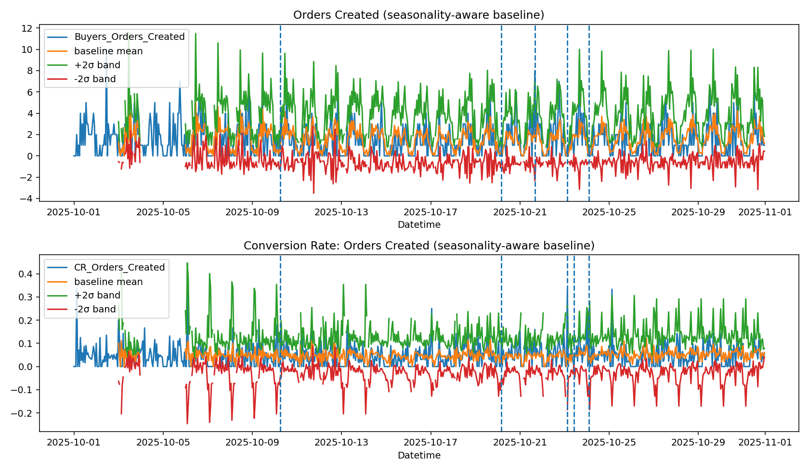

# 📊 Hourly Behavioral Monitoring System

A seasonality-aware early warning system for ecommerce funnel metrics.  
Instead of reacting to KPI shocks, this project builds a structured monitoring pipeline that detects anomalies, prioritizes actions, and produces an executive-ready weekly brief.

---

## 🔎 What Problem Does This Solve?

Ecommerce KPIs fluctuate naturally by:

- Hour of day  
- Weekend vs weekday  
- Traffic patterns  

Simple thresholds (e.g. “CR < 3% = alert”) generate noise.

This project builds a **seasonality-aware monitoring pipeline** that:

- Learns rolling baselines  
- Computes z-scores per regime  
- Detects sustained anomalies  
- Prioritizes signals into an action queue  
- Generates a weekly executive brief  
- Produces monitoring visualizations automatically  

---

## 🖼 Monitoring Snapshot



The figure shows:

- Orders Created with ±2σ seasonal band  
- Conversion Rate with ±2σ band  
- Marked anomaly timestamps  
- Clean separation between noise and signal  

---

# 🧠 System Architecture

```
raw data
   ↓
FeatureStore (cleaning + seasonality-aware baselines)
   ↓
EarlyWarningSystem (hard rules + frequency detection)
   ↓
RootCauseAnalyzer (funnel-based diagnosis)
   ↓
ActionQueueBuilder (prioritized actions)
   ↓
ReportBuilder (executive markdown brief)
   ↓
Visualizer (monitoring plots)
```

---

# 📂 Project Structure

```
src/
  case.py                → main pipeline entrypoint
  feature_store.py       → baseline + z-score computation
  early_warning.py       → anomaly detection logic
  root_cause.py          → funnel-based diagnostics
  action_queue.py        → prioritization layer
  report_builder.py      → executive weekly brief
  visualizer.py          → monitoring plots
  segmentor.py           → time-based regime segmentation

data/raw/
  dataset_ecommerce_hourly.csv

results/
  alerts/                → action_queue.json
  tables/                → action_queue.csv
  figures/               → monitoring PNGs (generated)

reports/
  weekly_brief.md        → executive summary (generated)

assets/
  hero_monitoring.png    → static portfolio figure
```

---

# ⚙️ Installation

### 1️⃣ Clone

```bash
git clone https://github.com/<your-username>/Hourly-Behavioral-Case.git
cd Hourly-Behavioral-Case
```

### 2️⃣ Create virtual environment (recommended)

```bash
python3 -m venv .venv
source .venv/bin/activate
```

### 3️⃣ Install dependencies

```bash
pip install -r requirements.txt
```

Minimal dependencies:

```
pandas
numpy
matplotlib
```

---

# ▶️ How To Run

Single command:

```bash
python3 -m src.case
```

Optional debug mode:

```bash
DEBUG=1 python3 -m src.case
```

---

# 📤 Outputs

After running the pipeline, the system generates:

## 1️⃣ Action Queue (machine-readable)

```
results/alerts/action_queue.json
results/tables/action_queue.csv
```

Each row contains:

- issue_type (Risk / Opportunity / Watchlist)
- severity
- confidence
- metric
- signal description
- recommended_action
- owner_hint
- verification_step
- stop_rule

---

## 2️⃣ Executive Brief (human-readable)

```
reports/weekly_brief.md
```

Includes:

- Topline summary  
- Alert budget (limits noise)  
- “What to do today”  
- Risks  
- Opportunities  
- Watchlist table  

---

## 3️⃣ Monitoring Figures

```
results/figures/
```

Includes:

- orders_created.png  
- orders_created_z.png  
- cr_orders_created.png  
- cr_orders_created_z.png  
- funnel_index.png  
- hero_monitoring.png  

---

# 🧮 Methodology

## Seasonality-Aware Baselines

Instead of global rolling averages, baselines are computed by regime:

- hour of day  
- weekend vs weekday  

This prevents false positives during expected traffic swings.

---

## Z-Score Normalization

For each metric:

```
z = (value - baseline_mean) / baseline_std
```

Alerts are triggered when:

- |z| > threshold  
- sustained over time  
- or frequency exceeds window limits  

---

## Alert Budget

To avoid alert fatigue:

- Max N high-priority items are shown in “What to do today”  
- Remaining signals move to Watchlist  

---

## Root Cause Layer

When sustained anomalies occur:

- Funnel metrics are analyzed  
- Traffic vs checkout vs discovery drivers are inferred  
- Owner suggestions are generated  

---

# 🚀 Potential Extensions

- KS-Test / PSI distribution drift  
- Segment-level monitoring (device, channel, geo)  
- Slack / Email integration  
- Alert suppression rules  
- Bayesian anomaly detection  
- Real-time streaming ingestion  

---

# 🏁 Project Status

✔ End-to-end functional  
✔ Clean reproducible pipeline  
✔ Seasonality-aware anomaly detection  
✔ Executive-ready reporting  
✔ Portfolio-ready visualization  

---

# 👩‍💻 Author

Jana Lea Godin  
Data Analytics / Behavioral Monitoring / Decision Systems